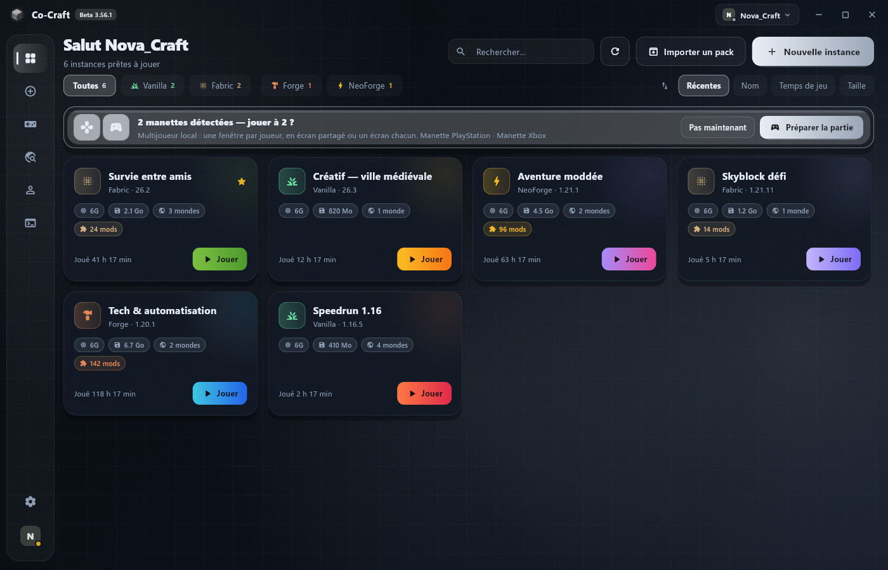
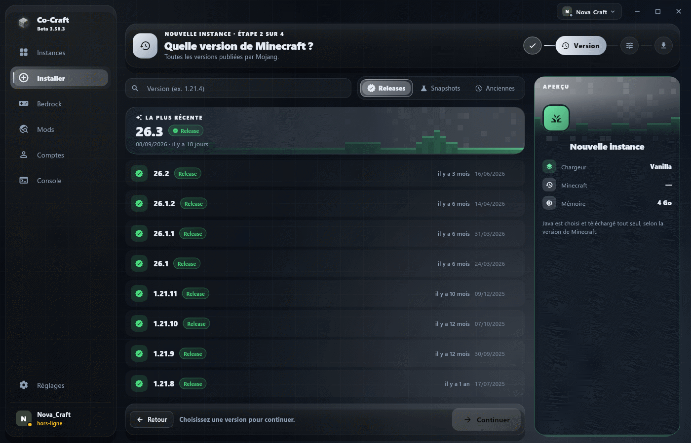
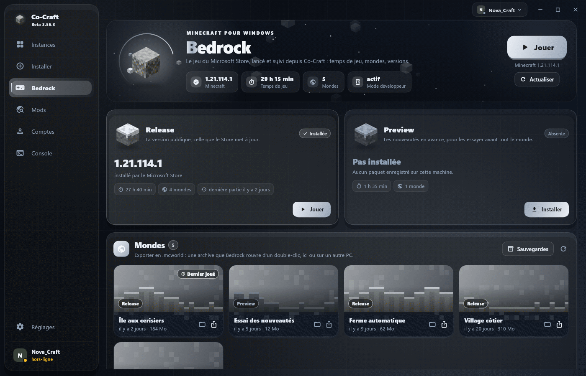
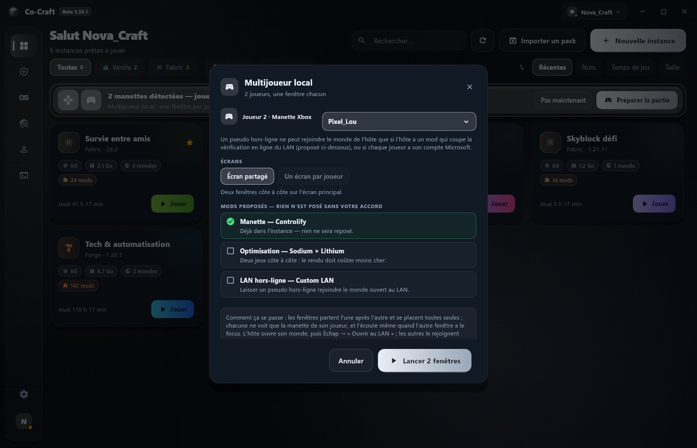
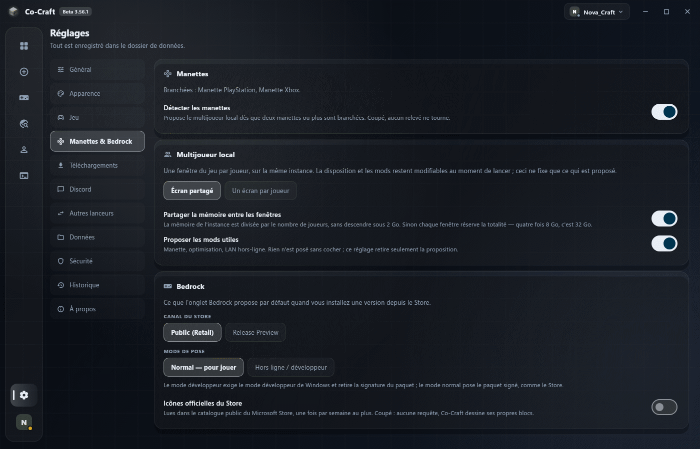

# Co-Craft

Un launcher Minecraft pour **Windows et Linux**. Il installe Java, Minecraft et
le chargeur de mods à votre place, gère vos instances, vos comptes et vos mods,
et vous laisse jouer.

> **Ce dépôt ne contient que les versions compilées.** Pas de code source : les
> fichiers publiés dans [Releases](../../releases) sont tout ce qu'il y a ici.

---

## Aperçu



*Accueil : vos instances Minecraft Java en cartes, et le bandeau qui propose de jouer à plusieurs dès que deux manettes sont branchées.*



*Nouvelle instance, étape « Version » : toutes les versions de Minecraft Java, de la plus récente à la plus ancienne.*



*Onglet Bedrock : Minecraft pour Windows, avec son temps de jeu, ses mondes, et l'installation d'une version depuis le Store.*



*Multijoueur local : une fenêtre par joueur et une manette chacun ; Co-Craft dit quels mods sont déjà là et ne pose rien sans votre accord.*



*Réglages « Manettes & Bedrock » : détection des manettes, écran partagé ou un écran par joueur, et options de Bedrock.*

---

## Télécharger

Prenez le fichier qui correspond à votre système dans la
**[dernière version](../../releases/latest)** :

| Système | Fichier | Quoi en faire |
|---|---|---|
| **Windows** | `cocraft-vX.Y.Z.exe` | Double-cliquez. C'est l'installeur. |
| **Linux** | `cocraft-vX.Y.Z-linux-x64.tar.gz` | Décompressez, puis lancez `./install.sh`. |

Les nouveautés de chaque version sont dans `changelog.md`, publié à côté des
installeurs.

---

## Installation

### Windows

L'installeur ne demande **aucun droit administrateur** : tout va dans votre
profil utilisateur (`%LOCALAPPDATA%\Co-Craft`). Une case à la fin propose de
lancer l'application, rien ne démarre sans votre accord.

### Linux

```bash
tar -xzf cocraft-vX.Y.Z-linux-x64.tar.gz
cd cocraft-vX.Y.Z-linux-x64
./install.sh
```

L'application est posée dans `~/.local/share/co-craft`, avec un lien dans
`~/.local/bin/cocraft` et une entrée dans le menu des applications.
`./uninstall.sh` fait le chemin inverse.

---

## ⚠ Votre antivirus va peut-être râler

**Autant vous le dire franchement plutôt que vous laisser le découvrir.**

Windows Defender signale parfois l'installeur comme `PUA:Win32/Puwaders.C!ml`.
C'est un verdict d'**apprentissage automatique**, pas une signature : Co-Craft
correspond au profil d'un « dropper » parce qu'il télécharge des exécutables
(Java, Minecraft), les écrit dans un dossier utilisateur et les lance. C'est
littéralement son travail, et **tous les launchers tiers y passent**.

Ce qui a été mesuré, sur VirusTotal :

| Fichier envoyé | Verdict |
|---|---|
| L'application seule, hors installeur | **0 / 70 — propre** |
| L'installeur signé | 2 / 71 |

Autrement dit : la détection porte entièrement sur l'enveloppe d'installation,
pas sur le programme.

L'installeur **est signé**, mais par un certificat auto-signé — il n'a donc
aucune réputation auprès de Microsoft, et chaque nouvelle version repart de
zéro. Un certificat reconnu coûte plusieurs centaines d'euros par an, ce qui
n'a pas de sens pour un projet gratuit.

**Si vous n'êtes pas à l'aise, ne l'installez pas.** C'est une réponse
légitime, et je préfère l'écrire ici que de vous rassurer à bon compte.

---

## Où vont vos données

**Pas dans le dossier d'installation** — elles survivent à une
désinstallation :

* **Windows** — `%APPDATA%\Co-Craft\Minecraft`
* **Linux** — `~/.local/share/Co-Craft/Minecraft`

Vos instances, vos mondes, vos mods et vos comptes vivent là. La
désinstallation vous demande explicitement si vous voulez les garder ou tout
effacer.

Le dossier se change dans **Réglages → Données**.

---

## Ce que fait le launcher

| | |
|---|---|
| **Chargeurs** | Vanilla, Fabric, Quilt, Forge, NeoForge |
| **Java** | téléchargé et installé automatiquement, la bonne version pour chaque instance |
| **Comptes** | Microsoft et hors-ligne, en multi-comptes, **jetons chiffrés sur le disque** |
| **Mods** | Modrinth et CurseForge, dépendances suivies, mises à jour, contrôle d'intégrité |
| **Instances** | duplication, réparation, RAM, verrou par mot de passe, raccourci bureau |
| **Mondes** | sauvegarde automatique avant lancement, restauration, lancement direct dans un monde |
| **Skins** | vestiaire local, capes, récupération de votre skin d'origine |

---

## Vos comptes

Les jetons de connexion Minecraft sont **chiffrés sur le disque**, et un mot de
passe maître facultatif ferme complètement le coffre.

Ce que ça protège, et ce que ça ne protège pas : un jeton vaut le compte
lui-même, et c'est ainsi que les comptes se font voler — par un fichier ramassé
sur le disque. Le chiffrement l'empêche. En revanche, **sans mot de passe
maître, un programme lancé sous votre session Windows peut demander à Windows
de déchiffrer**, exactement comme le launcher le fait. C'est la limite de tout
stockage automatique, navigateurs compris.

---

## Mises à jour

Le launcher vérifie les nouvelles versions au démarrage et vous le propose —
jamais de force, et le rappel se reporte de trois jours. L'installation se fait
sur place : vos instances, vos mondes et vos comptes ne sont pas touchés.

---

## Configuration requise

* **Windows 10 ou 11** (64 bits), ou une distribution Linux récente avec GTK 3
* Environ **1 Go** pour l'application, plus la place des instances — comptez
  2 à 5 Go par instance selon les mods
* Une connexion internet pour la première installation de chaque version de
  Minecraft

Le launcher refuse de créer une instance ou de télécharger s'il reste moins de
2 Go libres. **Jouer reste toujours possible** : un disque plein empêche
d'ajouter, pas de lancer une partie déjà installée.

---

## Problèmes et questions

Ouvrez une [issue](../../issues) en décrivant ce que vous faisiez et ce qui
s'est passé. La console du launcher (onglet **Console**) contient le journal du
jeu ; le rapport de plantage y est aussi.

---

## Licence et mentions

Co-Craft est un projet indépendant de **Co-Dev**. Il n'est ni affilié à, ni
approuvé par Mojang Studios ou Microsoft. Minecraft est une marque de Mojang
Studios.

Aucune ressource du jeu n'est redistribuée : le launcher télécharge tout depuis
les serveurs officiels de Mojang, et les mods depuis Modrinth et CurseForge.
